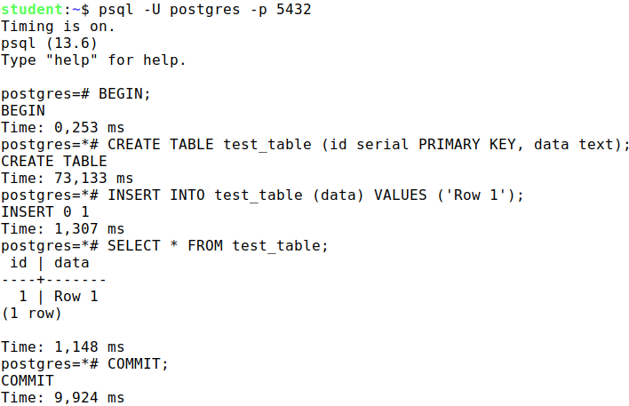
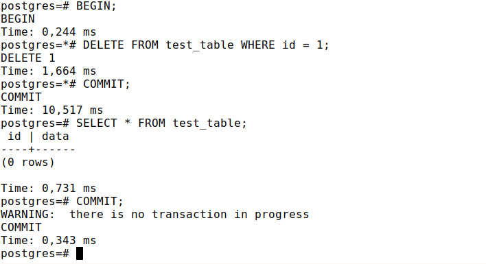
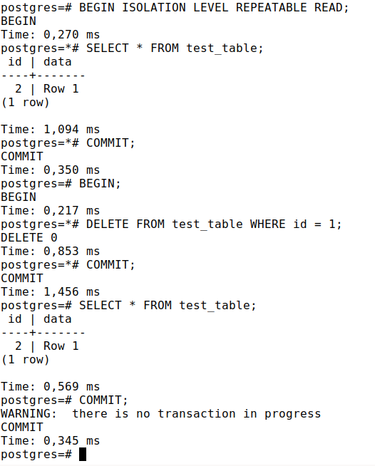

## (25 points) Practice "Isolation and multiversionality"

1. Create a table with a single row.

    Start the first transaction at the Read Committed and query the table.
    
    In the second session, delete the row and commit the changes.
    
    How many rows will the first transaction see by executing the same query again? Check.
    
    Complete the first transaction.
2. Do the same thing again, but now have the transaction running at isolation level Repeatable Read:
    
    `BEGIN ISOLATION LEVEL REPEATABLE READ;`

    Explain the differences.

### Solution

1. First transaction at the Read Committed and query the table:

    `psql -U postgres -p 5432`

    

    In the second session, delete the row and commit the changes and check the first transaction:

    

2. Both transactions at isolation level Repeatable Read:

    `psql -U postgres -p 5432`

    

    As we can see, in the first case, the transaction sees the changes made by the second transaction, and in the second case, the transaction does not see the changes made by the second transaction.

## (25 points) Practice+ "Isolation and multiversionality"(optional)

1. Start a transaction and create a new table with a single row. Without terminating the transaction, open a second session and query the table in it. Check to see what the transaction in the second session sees

    Commit the transaction in the first session and run the table query in the second session.
2. Repeat task 1, but rollback rather than commit the transaction in the first session. What has changed?
3. In the first session, start the transaction and run a query on the table you created earlier. Will you be able to delete this table in the second session while the transaction is still in progress?
    
    Check

### Solution

## (25 points) Practice "Pereodic tasks"

1. disable the auto-cleaning process and make sure it is not running.
2. In the new database, create a table with a single numeric column and an index on that table. Insert into the table 100,000 random numbers.
3. Change half of the rows of the table several times, controlling the size of the table and index at each step.
4. Perform a complete cleanup.
5. Repeat step 4, calling after each change a after each change. Compare the results.
6. Enable the auto-cleaning process.

### Solution

## (25 points) Practice "Buffer cache"

1. Use the operating system to find the processes responsible for the buffer cache and the WAL log, responsible for the buffer cache and WAL log.
2. Stop PostgreSQL in fast mode; start it again. Review the server's message log.
3. Now stop in immediate mode and start it again. Review the server message log and compare with the previous one.

### Solution