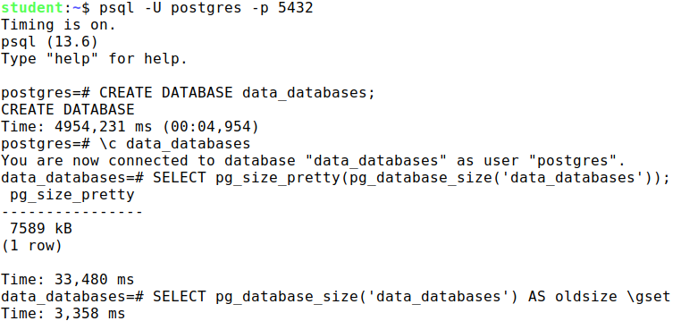
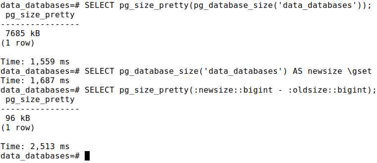
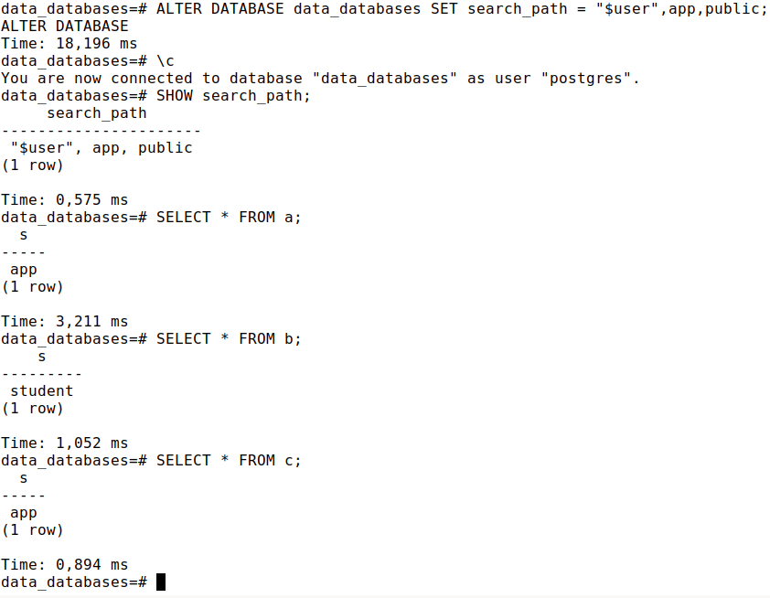
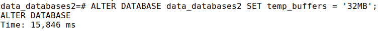

## (15 points) Practice "Databases and schemas"

1. Create a new database and connect to it.
2. Check the size of the created database.
3. Create two schemas: an app and one named the same as the user.
Create some tables in both schemas and populate them with some data.
4. Check how much the size of the database has increased by.
5. Set the search path so that when you connect to the database:
    * tables from both schemas will be accessible by unqualified name
    * the priority should be given to the "custom" schema.

### Solution

1. `psql -U postgres -p 5432`

    

2. Using `CREATE TABLE`, `CREATE SCHEMA` and `INSERT INTO` commands, create a database with the structure.

3. All done in the previous step.

4. Check the size of the created database.

    

5. Set the search path so that when you connect to the database:

    

## (10 points) Practice+ "Databases and schemas"(optional)

Create a database. For all sessions in this database set the temp_buffers parameter to four times more than default value

### Solution

* [Here we can find the default value of `temp_buffers`](https://postgresqlco.nf/doc/en/param/temp_buffers/) Spoiler: it's 8MB. So we need to set it to 32MB.

    

## (15 points) Practice "System catalog"

1. Get a description of the pg_class table.
2. Obtain a detailed description of the pg_tables view.
3. Create a database and a temporary table in it. Get a complete list of schemas in the database, including system schemas.
4. Get the list of views in the information_schema schema.
5. What queries does the following psql command perform? \d+ pg_views

### Solution

## (20 points) Practice "Tablespaces"

Why is it that when creating a database without a sentence
TABLESPACE is the default tablespace
becomes pg_default?
1. Create a new tablespace.
2. Change the default tablespace for the database template1 database to the created space.
3. Create a new database. Check which default tablespace is set for the new database.
4. Look in the file system for a symbolic link in PGDATA to the tablespace directory.
5. Delete the created tablespace.

### Solution

## (10 points) Practice+ "Tablespaces"(optional)

Set the random_page_cost parameter to 1.1 for tablespace pg_default.

## (20 points) Practice "Low level"

1. Create a non-journaled table in a custom tablespace and make sure that there is an init layer for the table init layer exists for the table. Delete the created tablespace.
2. Create a table with a column of type text. What storage strategy is used for this column? Change the strategy to external and insert the short and long rows into the table short and long rows.
    
    Check if the rows have gotten into the toast table by executing a direct query to it.
    
    Explain why.

### Solution

## (10 points) Practice+ "Low level"

Compare the database size returned by the pg_database_size function with the total size of all tables in the database.

Explain the result obtained.

### Solution

