## (30 points) Practice (Monitoring)

1. In a new database, create a table, perform an insertion of a few rows and then delete all rows. Look at the statistics of the table accesses and match the the numbers (n_tup_ins, n_tup_del, n_live_tup, n_dead_tup) to your activity. Perform a cleanup (vacuum), check the statistics again and compare with the previous figures.
2. Create a situation where two transactions interlock(deadlock). See what information is recorded to the server's message log.

### Solution

1.  after adding and removing 10 rows we get:

    ```
    monitoring=# CREATE TABLE t(n numeric);
    CREATE TABLE
    Time: 94,847 ms
    monitoring=# INSERT INTO t SELECT 1 FROM generate_series(1,10);
    INSERT 0 10
    Time: 35,787 ms
    monitoring=# DELETE FROM t;
    DELETE 10
    Time: 14,225 ms
    ```

    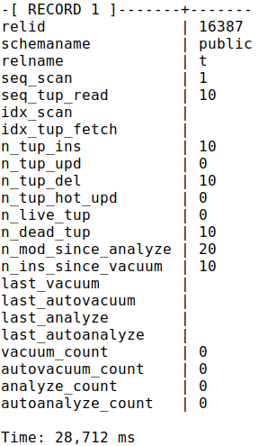

    after vacuum:

    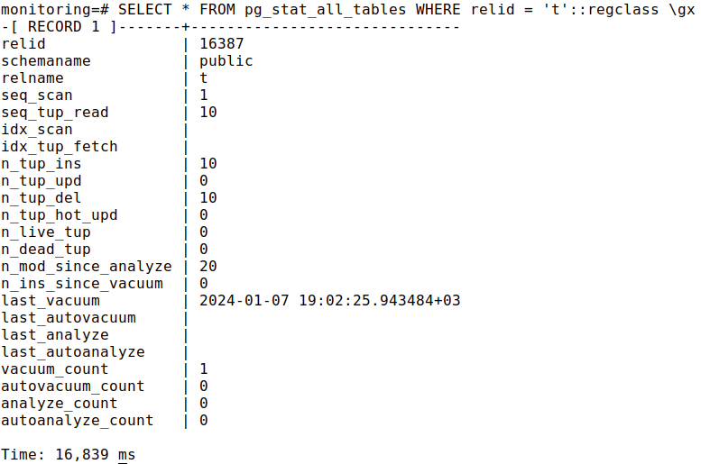

    Outdated versions of rows were removed during cleanup (n_dead_to = 0), cleanup processed the table once (vacuum_count = 1).

2.  We can create a deadlock by running two transactions in parallel, in one of which we will update the first row and change second, while another transaction  try to update the second row, and then change the first row.

    ```
    \\first transaction
    UPDATE t SET n = 10 WHERE n = 1;
    UPDATE t SET n = 1 WHERE n = 2;
    \\second transaction
    UPDATE t SET n = 1 WHERE n = 2;
    UPDATE t SET n = 10 WHERE n = 1;
    ```
    and we get deadlock:

    ```
    ERROR:  deadlock detected
    DETAIL:  Process 77492 waits for ShareLock on transaction 1043; blocked by process 78001.
    Process 78001 waits for ShareLock on transaction 1042; blocked by process 77492.
    HINT:  See server log for query details.
    CONTEXT:  while updating tuple (0,1) in relation "t"
    ```


## (5 points) Practice+(Monitoring)

1. Install the pg_stat_statements extension. Run a few queries. See what information is written into the pg_stat_statements view.

### Solution

1. Let's check installed behind the scenes

    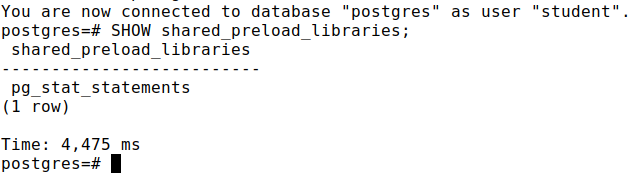

    after some manipulations with database we can see:

    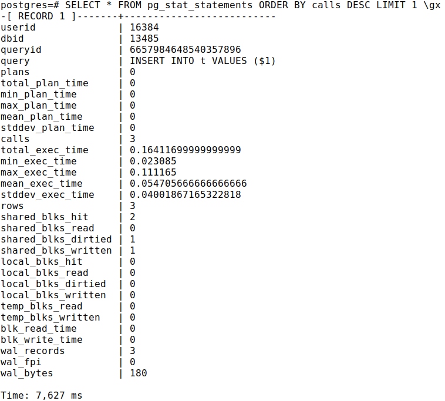

## (30 points) Practice(Roles&Attributes)

1. Create the creator role without login privileges, but with permission to create databases and roles. Create the user weak with the right to login. 
2. Ensure that weak cannot create a database. 
3. Include weak in the creator group. Create a new database under the weak user.

### Solution

1. `CREATE ROLE creator NOLOGIN CREATEDB CREATEROLE;`

    `CREATE ROLE weak LOGIN;`

    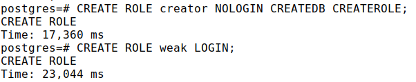

2. `CREATE DATABASE access_roles;`

    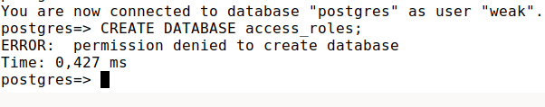

3. `GRANT creator TO weak;`

    `SET ROLE creator;`

    `CREATE DATABASE access_roles;`

## (5 points) Practice+ (Roles&Attributes)

1. Create the roles alice and bob with login privileges. Create a table under the alice role.
2. Make the necessary settings so that both roles can modify the table structure (e.g., add columns with the ALTER TABLE command).

### Solution

1. `CREATE ROLE alice LOGIN;`

    `CREATE ROLE bob LOGIN;`

    `SET ROLE alice;`

    `CREATE TABLE t(n numeric);`

    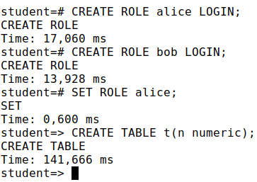

2. `ALTER TABLE t ADD COLUMN m numeric;`
    
    `SET ROLE bob;`
    
    `ALTER TABLE t ADD COLUMN k numeric;`
    
    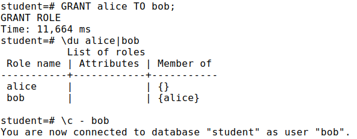

    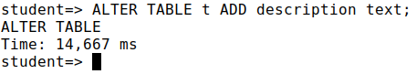

## (30 points) Practice (Privileges)

1. Modify the configuration files(pg_hba.conf) (having saved the originals beforehand) so that: 
    * unconditionally allow local connection for superusers student and postgres; 
    * allow network connections for all users to any databases with password authentication using the using MD5.
2. Create the alice role with an MD5 encrypted password, and the bob role with a SCRAM-SHA-256 encrypted password.
3. Verify that you can connect under the created roles.
4. Under the superuser role, look at the passwords of users alice and bob in the system directory.
5. Restore the original configuration files.

### Solution

1. `sudo cp -n /etc/postgresql/13/main/pg_hba.conf ~/pg_hba.conf.orig`

    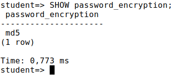

2. `CREATE ROLE alice LOGIN PASSWORD 'alice';`

    `CREATE ROLE bob LOGIN PASSWORD 'bob';`

    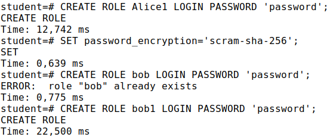

3. Let's check:

    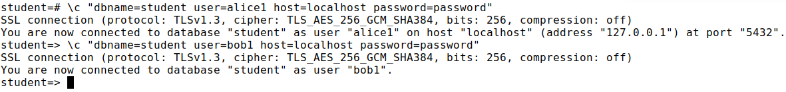

4. It's my be unsafe, but we can see passwords in pg_authid table:

    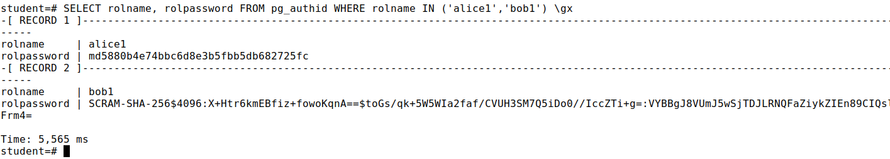

5. `sudo cp ~/pg_hba.conf.orig /etc/postgresql/13/main/pg_hba.conf`

    `sudo pg_ctlcluster 13 main reload`