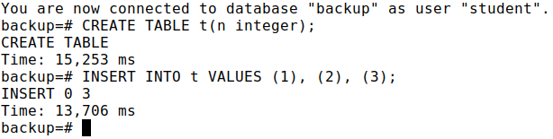
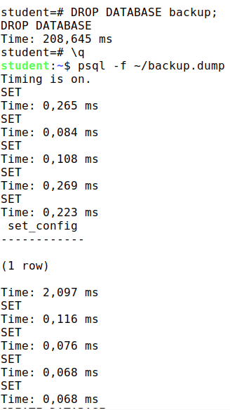
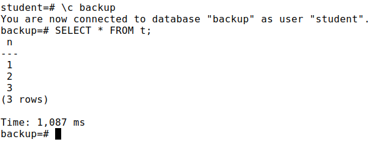
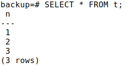

## (50 points) Practice Backup

1. Create a database and a table in it with several rows.
2. Make a logical copy of the database using pg_dump utility. Delete the database and restore it from the made copy.
3. Make an offline physical backup of the of the cluster using the pg_basebackup utility.
    
    Modify the table.
    
    Restore the new cluster from the backup you made and verify that the database does not contain any later changes.

### Solution

1. `CREATE DATABASE backup;`

    `CREATE TABLE t(n integer);`

    `INSERT INTO t VALUES (1), (2), (3);`

    

2. `pg_dump -f ~/backup.dump -d backup --create`

    and after drop database `backup` and restore it from the made copy:

    `psql -f ~/backup.dump`

    

    

3. Next commands were executed after some good classmated told me that there is already existing database `replica`:
    
    ```
    sudo rm -rf /home/student/basebackup

    pg_basebackup --pgdata=/home/student/basebackup

    sudo pg_ctlcluster 13 replica status

    sudo rm -rf /var/lib/postgresql/13/replica

    sudo mv /home/student/basebackup/ /var/lib/postgresql/13/replica

    sudo chown -R postgres:postgres /var/lib/postgresql/13/replica
    ```

    and after `psql -p 5433 -d backup`

    

## (50 points) Practice Replication

1. Configure physical streaming replication between two servers in synchronous mode.
2. Test the replication operation. Verify that when replication is stopped, the commit is not terminated.
3. Take the replica out of recovery mode.
4. Create two tables on both servers.
5. Configure logical replication of the first tablefrom one server to the other, and the second table in the opposite direction. 
6. Test the replication operation. To do this, set the parameters:
    - synchronous_commit = on,
    - synchronous_standby_names = &#039;replica&#039;, and on the replica in the file postgresql.auto.conf in the parameter primary_conninfo add &quot;application_name=replica&quot; to the primary_conninfo parameter

### Solution

1. `pg_basebackup --pgdata=/home/student/basebackup`

    `sudo pg_ctlcluster 13 replica status`

    `sudo rm -rf /var/lib/postgresql/13/replica`

    `sudo mv /home/student/basebackup/ /var/lib/postgresql/13/replica`

    `sudo chown -R postgres:postgres /var/lib/postgresql/13/replica`

    `echo "primary_conninfo = 'user=student port=5432 application_name=replica'" | sudo tee /var/lib/postgresql/13/replica/postgresql.auto.conf`

    `sudo touch /var/lib/postgresql/13/replica/standby.signal`

    `sudo pg_ctlcluster 13 replica start`

    after these commands we can start configuring our 
